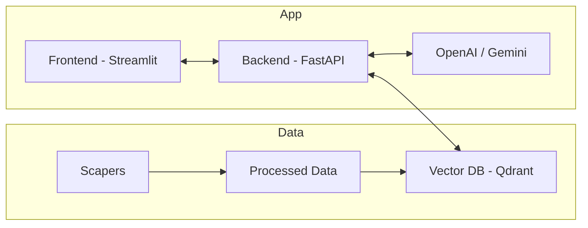

# System Architecture

## Overall Flow

1. **Ingestion**: `data_pipeline` crawls data -> processes to Markdown -> pushes to `qdrant`.
2. **Retrieval**: `backend_ai` receives query -> embeds it -> searches `qdrant`.
3. **Generation**: `backend_ai` sends prompt (context + query) to LLM -> returns reply.
4. **Interaction**: `frontend` displays chat interface to user.

## Component Diagram (Mermaid)

